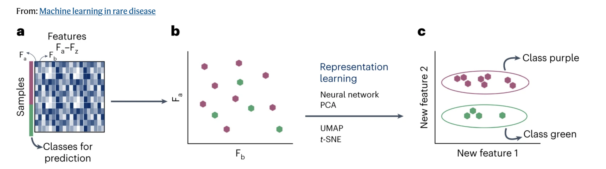

# Chapter 1 — I have only small data

“Simple models and a lot of data trump more elaborate models based on less data.” 
Halevy et al., 2018 “The Unreasonable Effectiveness of Data”

In the field of Machine Learning, it often seems as if everything revolves around big data. Models are frequently trained on massive datasets and large language models seem to have access to enormous amounts of information from the internet. However, despite the apparent abundance of data, it may not always be readily available.

**What to expect?**

In this chapter, we begin by exploring dimensions. You will then get hands-on experience implementing concepts from two figures in the paper "Machine learning in rare disease". Finally, we'll also go a step further and explore the concept of data augmentation, along with some of its nuances!

🚀 Let's start!

<strong>  Part 1 - Less is more? </strong>

Before starting with the figures in the seminar paper, let's do a quick detour to dimensions. 

[Go to the notebook](dimensions)

[🐘 Elephant data (for the bonus task in the notebook above)](data/elephant_points.csv) 

[Tutor guide for the session](tutor-guide)
[Class notes](notes)

<strong> Part 2 - Representation learning lite </strong>

In this section, you will explore a practical example to understand Fig. 2 from the paper "Machine learning in rare disease" that is also covered in the seminar. 

[Go to the notebook](dimensionality-reduction)

<strong> Part 3 - Why reinvent the wheel? </strong>

[Go to the notebook](transfer-learning)

<strong> Part 4 - What else is out there? </strong>

[Go to the notebook](further)

  

