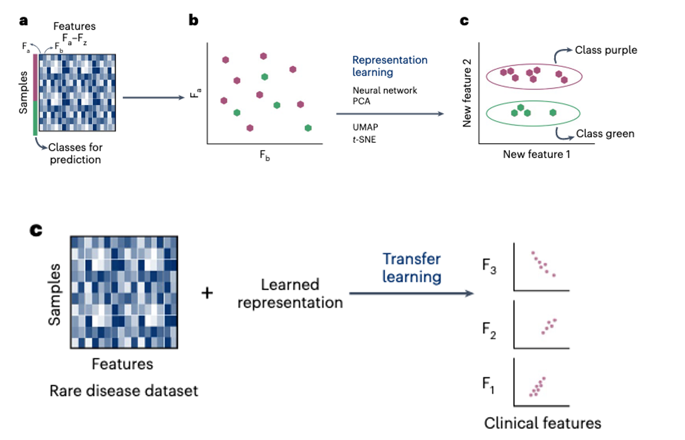

# Chapter 1 — I have only small data

“Simple models and a lot of data trump more elaborate models based on less data.” 
Halevy et al., 2018 “The Unreasonable Effectiveness of Data”

In the field of Machine Learning, it often seems as if everything revolves around big data. Models are frequently trained on massive datasets and large language models seem to have access to enormous amounts of information from the internet. However, despite the apparent abundance of data, it may not always be readily available.

**What to expect?**

In this chapter, we begin by an interactive classroom discussion where you will learn about the nuances of a common technique. Then we will take a bit of a theoretical detour and explore the curse of dimensionality. You will then get hands-on experience implementing concepts from figures in the paper "Machine learning in rare disease". 

🚀 Let's start!

<strong> Warm up - "Making" more data </strong>

[Go to activity](augment)

<strong> Data for Chapter 1 </strong>

[🐘 Elephant data (for the bonus task in Part 1 - Less is more?)](data/elephant_points.csv) 

<strong>  Part 1 - Less is more? </strong>

Let's do a quick detour to dimensions. 

[Go to the notebook](notebooks/0-dimensions.ipynb) ⏰ Deadline: Wednesday, April 29, 20:00

[Class notes](notes)

<strong> Part 2 - Representation learning </strong>

In this section, you will explore a practical example related to Fig. 2 and Fig 5. from the paper "Machine learning in rare disease" that is also covered in the seminar. 

Notebook to be unlocked on April 30! ⏰ Deadline: Wednesday, May 6, 20:00

Class notes (will be available after deadline)

<strong> 🧶 What else is out there? </strong>

  

